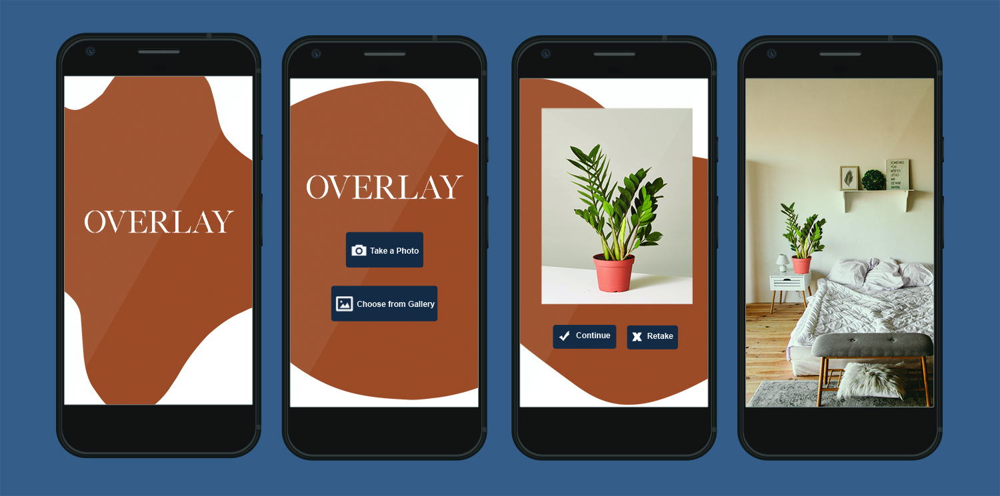

# OVERLAY

AR style app that takes a user captured photo of an object, uploads the image to the Cloudinary API (utilizing the AI Background Removal add-on) to isolate the object, then overlay the result onto the user's camera feed. Briefly, it will allow users to display what a captured object will look like in a new space via their camera.

## Getting Started

These instructions will get you a copy of the project up and running on your local machine.

### Prerequisites
* Node.js [Get the latest version here](https://nodejs.org/en/)
* Git [Download Git here](https://git-scm.com/)

* Download Expo Client from the [Google Play](https://play.google.com/store/apps/details?id=host.exp.exponent&referrer=www) or [App store](https://itunes.apple.com/app/apple-store/id982107779)

### Installing

Install Expo CLI with the following command:

```
npm install expo-cli
```

Clone project from github:

```
git clone https://github.com/kayajepson/Overlay-capstone
```
Install project dependencies:

```
npm install
```
Start the development server:

```
npm start
```

Open the app on your phone/tablet:

```
Scan QR code found in the terminal or on the Expo Dev Tools page
```

Navigate through the prompts to capture an image of an object and view the object in a new space via your device's camera feed.

## Built With

* [Expo SDK](https://docs.expo.io/versions/latest/) - React Native using Expo

## Project Screenshots


