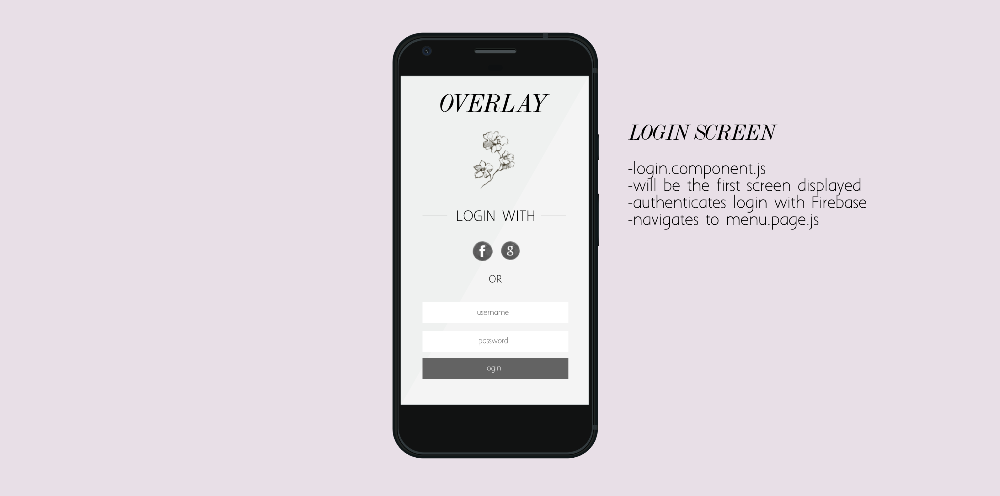
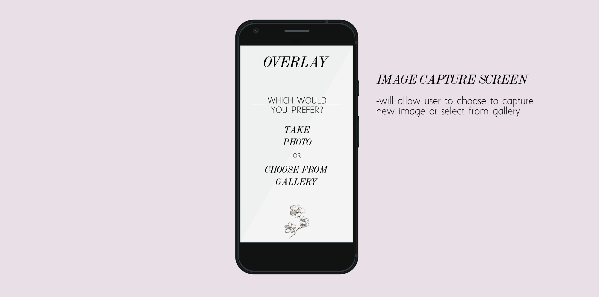
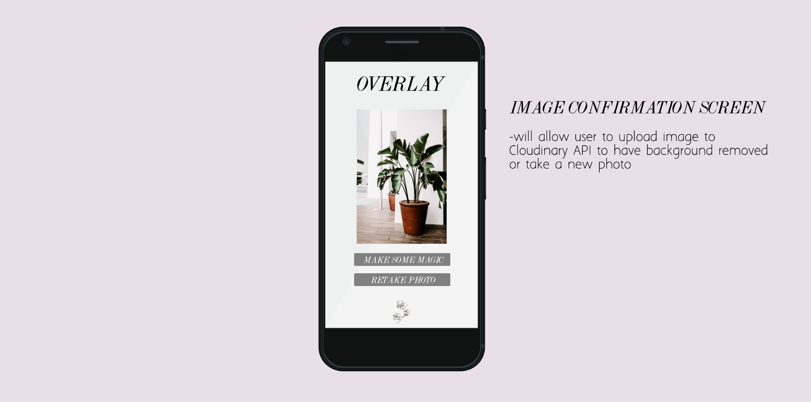
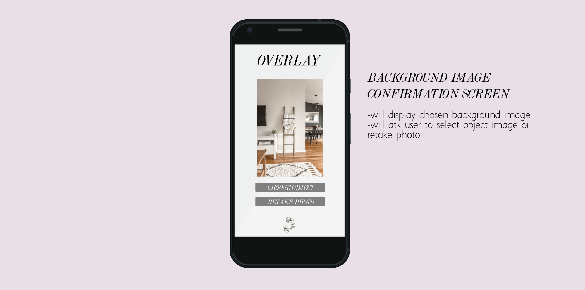
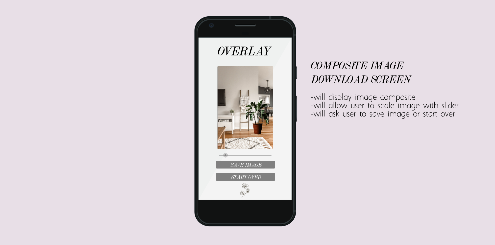

Project started by clone of: 
[Try it on Expo](https://expo.io/@documentation/camerja).

# OVERLAY

# PROJECT DESCRIPTION
***PROPOSAL SUBMITTED FOR CAPSTONE PROJECT***

**Name of Project:** Overlay

**Project’s Purpose or Goal: (What will it do for users?)**
Overlay allows users to capture a photo of an object, have that photo’s background removed, and overlay that image onto their camera app to display what the object would look like in a new space. A user can then save the composited image to their device.

**List the absolute minimum features the project requires to meet this purpose or goal:**  
The MVP will be a bit smaller scale (after speaking with Elly) since tackling React Native has proven to be difficult in the timeframe for group weeks / capstone projects. MVP will include a web app that allows users to select from a library of objects with the backgrounds already removed and overlay the selected object onto their choice of background from a separate library. Once those features have been implemented, my stretch goals will include allowing users to upload their own background image and download the final overlaid image to their device. Implementing the Cloudinary API to utilize their ‘Cloudinary AI Background Removal’ add on tool will be the next addition. Once I am able to implement this tool, I will allow users to upload their own image to be processed by the API. If I able able to get these features working, I will then tackle React Native to make my app fully functional on mobile (which is the ideal device).  

**What tools, frameworks, libraries, APIs, modules and/or other resources (whatever is specific to your track, and your language) will you use to create this MVP? List them all here. Be specific.**
React/React Native - build out the app  
Firebase (or C#) - database to hold image uploads?  
Materialize CSS or Material UI- styling  

**If you finish developing the minimum viable product (MVP) with time to spare, what will you work on next? Describe these features here: Be specific.**  
I went over these above - but to reiterate:  
Once the MVP has been achieved, my stretch goals will include allowing users to upload their own background image and download the final overlaid image to their device. Implementing the Cloudinary API to utilize their ‘Cloudinary AI Background Removal’ add on tool will be the next addition. Once I am able to implement this tool, I will allow users to upload their own image to be processed by the API. If I able able to get these features working, I will then tackle React Native to make my app fully functional on mobile (which is the ideal device).  

**What additional tools, frameworks, libraries, APIs, or other resources will these additional features require?**  
Cloudinary API - process images to remove background  
Firebase - user login and database

## COMPONENT TREE DRAFT

This is a draft of the component tree at first consideration. I anticipate some things being switched around as the project progresses.

## PRIMARY SCREEN MOCKUPS

Initial layout and design mockups. Floral asset is a stand in for a logo. I believe these are the main screens the user will see.

## AUTHOR

-   **Kaya Jepson**
